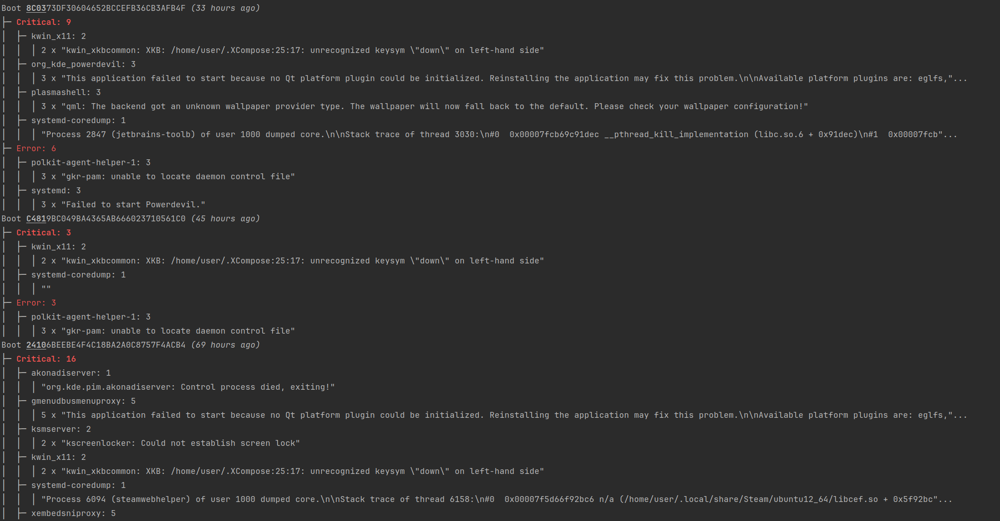

`odd` is a tool for Linux systems to analyze system errors across several boots.

# Usage
| Short option |      Long option      | Description                                                                                                                                                       |
|:------------:|:---------------------:|:------------------------------------------------------------------------------------------------------------------------------------------------------------------|
|      -b      |    --boots _BOOTS_    | The amount of boots to analyze [default: 25]                                                                                                                      |
|      -p      | --priority _PRIORITY_ | The minimum priority level of entries to analyze [default: error] [possible values: `emerge`, `alert`, `critical`, `error`, `warning`, `notice`, `info`, `debug`] |
|      -o      |         --old         | Get data from oldest boots                                                                                                                                        |
|      -r      |       --reverse       | Reverse output showing newest first                                                                                                                               |
|      -c      |        --color        | Use ANSI escape codes to display color                                                                                                                            |
|      -h      |        --help         | Print help                                                                                                                                                        |
|      -V      |       --version       | Print version                                                                                                                                                     |

# Output

# Performance
`odd` is able to analyze the data from the past 500 boots in about 5.7 milliseconds on my machine.
The `measure.sh` bash script can be used to test this.

| Execution time (average of 1000 runs) | Maximum memory (KiB) |
|---------------------------------------|----------------------|
| 5.754ms                               | 2496                 |
